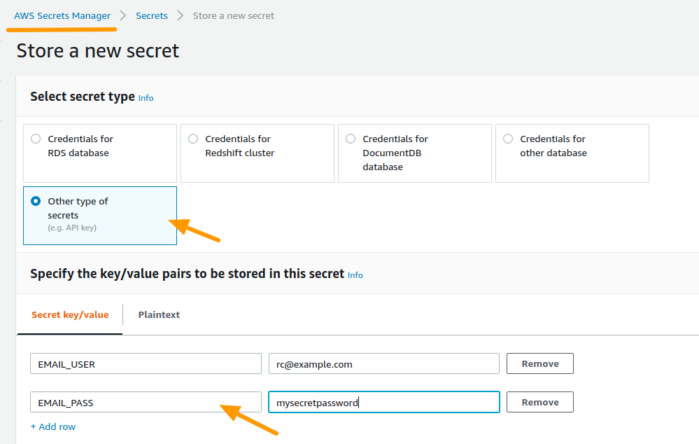
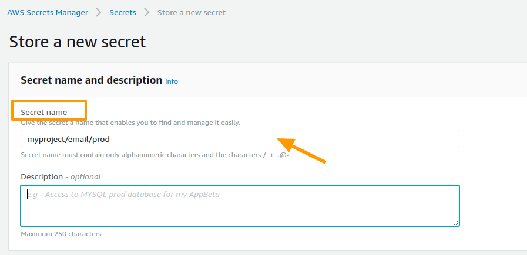
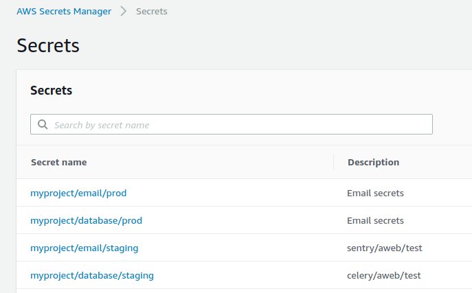

aws-vault
===============================


version number: 0.1.1
author: Spacetime Labs

Why
---

It's pretty handy using the AWS Secrets Manager to store sensitive KEY and VALUE pars such as an AWS bucket, database, credentials to external API and other services.
Then you'll need something simple to get those secrets in your project rather than using boto directly, you also might need an environment variables fall back and have multiple environment (testing, staging, production) support.

Overview
--------

Given secrets created in the AWS Secrets Manager:








Installation / Usage
--------------------

To install use pip:

    $ pip install awsvault


Or clone the repo:

    $ git clone https://github.com/spacetimelabs/awsvault.git
    $ python setup.py install
    

Usage
-----

Basic usage
```python
from awsvault import Vault

vault = Vault("myproject/email/prod")
email_user = vault.get("EMAIL_USER")
email_password = vault.get("EMAIL_PASS")
```

More than on set of secrets
```python
from awsvault import Vault

vault = Vault("myproject/email/prod,myproject/database/prod")
email_user = vault.get("EMAIL_USER")
email_password = vault.get("EMAIL_PASS")

db_hostname = vault.get("DB_HOSTNAME")
db_username = vault.get("DB_USERNAME")
db_password = vault.get("DB_PASSWORD")
```

Get values from environment variables (Local/Development)
```python
from awsvault import Vault

vault = Vault(None)
email_user = vault.get("EMAIL_USER")

```

How we usually use it

```python
import os
from awsvault import Vault

# In dev, the PROJECT_SECRETS is None and all secrets are set in the environment variables

# In testing, the PROJECT_SECRETS is mysecret/testing
# In prod, the PROJECT_SECRETS is mysecret/prod

PROJECT_SECRETS = os.environ['PROJECT_SECRETS']

# Then
vault = Vault(PROJECT_SECRETS)

my_secret = vault.get("MY_SECRET")
```

It's also possible to override the default `os.environ` fall back to a dict or something callable

```python
OVERRIDE = {
    'EMAIL_USER': 'bart.simpsons@example.com'
}

vault = Vault("myproject/email_secrets", look_first=OVERRIDE)
email_user = vault.get('EMAIL_USER')
assert email_user == 'bart.simpsons@example.com'
```

```python
def my_super_special_get_config_fn(name):
    if name == 'FRUIT':
        return 'avocado'


vault = Vault("myproject/email_secrets", look_first=my_super_special_get_config_fn)
email_user = vault.get('EMAIL_USER')
fruit = vault.get('FRUIT')

assert fruit == 'avocado'
```

check the `tests` out for more usage examples

Contributing
------------

``` 
pip install requirements-dev.txt
tox
```